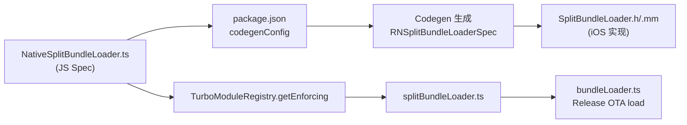

这个项目里 **TurboModule + Codegen spec 只用在一件事上**：iOS 上的 **`SplitBundleLoader`** 原生模块，用来在 Release 模式下把 OTA 下载的 split bundle 加载进现有 RN runtime。

## 整体链路



---

## 1. JS Spec（Codegen 输入）

`rn_app/src/specs/NativeSplitBundleLoader.ts` 是唯一一份 spec 文件：

```1:8:rn_app/src/specs/NativeSplitBundleLoader.ts
import type { TurboModule } from 'react-native';
import { TurboModuleRegistry } from 'react-native';

export interface Spec extends TurboModule {
  load(fileUrl: string, segmentId: number): Promise<void>;
}

export default TurboModuleRegistry.getEnforcing<Spec>('SplitBundleLoader');
```

---

## 2. Codegen 配置

`rn_app/package.json` 里的 `codegenConfig` 指向 `src/specs`，生成名为 `RNSplitBundleLoaderSpec` 的模块：

```52:64:rn_app/package.json
  "codegenConfig": {
    "name": "RNSplitBundleLoaderSpec",
    "type": "modules",
    "jsSrcsDir": "src/specs",
    "android": {
      "javaPackageName": "com.rnapp"
    },
    "ios": {
      "modules": {
        "SplitBundleLoader": "SplitBundleLoader"
      }
    }
  }
```

构建时 Codegen 会生成 `NativeSplitBundleLoaderSpecBase`、`NativeSplitBundleLoaderSpecJSI` 等（Pod 里对应 `ReactCodegen`，路径类似 `build/generated/ios/ReactCodegen`）。

---

## 3. iOS 原生实现

| 文件 | 作用 |
|------|------|
| `rn_app/ios/BrownfieldLib/SplitBundleLoader.h` | 继承 Codegen 基类 `NativeSplitBundleLoaderSpecBase` |
| `rn_app/ios/BrownfieldLib/SplitBundleLoader.mm` | 实现 `load(fileUrl, segmentId)` + `getTurboModule` → `NativeSplitBundleLoaderSpecJSI` |

关键 TurboModule 注册：

```209:218:rn_app/ios/BrownfieldLib/SplitBundleLoader.mm
#ifdef __cplusplus
- (std::shared_ptr<facebook::react::TurboModule>)getTurboModule:
    (const facebook::react::ObjCTurboModule::InitParams &)params
{
#if __has_include(<RNSplitBundleLoaderSpec/RNSplitBundleLoaderSpec.h>)
  return std::make_shared<facebook::react::NativeSplitBundleLoaderSpecJSI>(params);
#else
  return nullptr;
#endif
}
#endif
```

`.h` 里还有 `#if __has_include` 回退：Codegen 头文件不存在时退到 Legacy `RCTBridgeModule`。

---

## 4. JS 侧调用

- **薄封装**：`rn_app/src/features/splitBundleLoader.ts` — 重新导出 spec 模块
- **业务入口**：`rn_app/src/features/bundleLoader.ts` — Release OTA 加载时调用：

```120:120:rn_app/src/features/bundleLoader.ts
  await SplitBundleLoader!.load(path, segmentId);
```

Dev 走 Metro `loadBundleFromServer`；Release + 本地缓存文件才走这个 TurboModule。

---

## 5. Android

`codegenConfig` 里配了 `android.javaPackageName`，但 **Android 目录下没有 `SplitBundleLoader` 实现**。目前 TurboModule + Codegen 实际只在 **iOS BrownfieldLib** 落地。

---

## 背景说明

根据 `docs/fixes/2026-07-08-split-bundle-segment-contract.md`，这是为适配 RN 0.86 **New Architecture / Bridgeless** 加的：Legacy `NativeModules` + `@synthesize bridge` 在 `fabric: true` 下会 crash，所以改成 TurboModule + Codegen。

**结论**：全项目只有 **`SplitBundleLoader` 这一处** TurboModule + Codegen spec，服务于 **Release OTA split bundle 动态加载**。