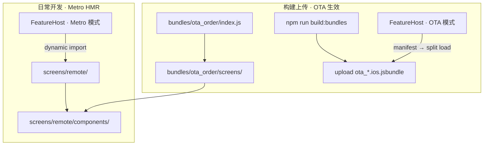

# 案例总结：Brownfield RN Remote 业务 Metro / OTA 双路径隔离

> 本文档用于面试复盘：问题背景、根因、方案、方法论与口述要点。  
> 相关实现文档：[dynamic-multi-bundle.md](./dynamic-multi-bundle.md)  
> **OTA 重复进入专项（面试）**：[interview/ota-reentry-case-study.md](./interview/ota-reentry-case-study.md)

---

## 一句话版本（30 秒）

在一个 **Native + React Native 混合（Brownfield）** 项目里，Remote 业务页同时支持 **Metro 热更新开发** 和 **OTA 远程 bundle 发版**。我设计并落地了一套 **双路径隔离方案**：Metro 走 `screens/remote/`，OTA 走 `ota_*` 前缀的 split bundle，并配套 registry 恢复、文档和防误操作护栏，解决了模式切换崩溃、改错目录、upload 不生效等工程问题。

---

## 项目背景

- **架构**：iOS 原生壳 + RN 主 bundle（Scheme 1 固定页）+ Remote 远程业务（manifest 驱动，可 OTA）
- **技术栈**：React Native、Metro split bundle、Fastify bundle-server、Prisma、iOS `SplitBundleLoader`
- **业务场景**：同一套 Remote 页面（订单、活动），开发时需要 HMR，上线时需要无 App Store 发版更新

```
Native Shell
├── Scheme 1 · 核心 RN（本地固定，不走 OTA）
└── Remote · 远程业务（manifest + split bundle + OTA）
```

---

## 核心问题（三层）

### 问题 1：Metro 与 OTA 源码 / 注册冲突

**现象**

- DEBUG 工具栏切换 Metro ↔ OTA，或第二次进入 OTA 页
- 报错：`bundle 已加载但未注册 ota_* 组件（source=none）`

**根因**

| 层 | 切换模式时发生了什么 |
|----|----------------------|
| JS registry | `clearFeatureRegistration()` 被清空 ✓ |
| 沙盒 bundle + metadata | 仍在，version 命中缓存 ✓ |
| Native segment | 仍在内存，`registerSegmentWithId` **不会 re-eval** ✗ |
| registerFeature | 入口 `__r()` 不再执行 → `source=none` ✗ |

早期 Metro 与 OTA 还共用相同 module 名（`OrderScreen`）和相似源码，切换时 registration 互相污染。

**处理方式**

1. **`ota_` 前缀隔离**
   - Bundle 文件：`ota_order.<version>.ios.jsbundle`
   - 模块名：`ota_OrderScreen`
   - manifest `featureId` 保持 `order`（不改服务端 key）

2. **严格双路径路由（FeatureHost）**
   - Metro 模式 → 仅 dynamic import `screens/remote/`
   - OTA 模式 → 仅 manifest → download → split load
   - DEBUG 下 **不做 cross-fallback**，问题尽早暴露

3. **OTA component cache 恢复 registry**
   - 首次 OTA `registerFeature` 时写入 `__OTA_COMPONENT_CACHE__`
   - 模式切换后 native 跳过 re-eval 时，从 cache 恢复 JS registry

**相关 fix 记录**

- [2026-07-08-ota-mode-switch-registration-lost.md](./fixes/2026-07-08-ota-mode-switch-registration-lost.md)

---

### 问题 2：开发者容易改错目录

**现象**

- `screens/ota/` 与 `screens/remote/` 并列在 `screens/` 下
- 改 `screens/ota/` 却等 Metro HMR；或只改 Metro 路径却期望 upload 后 OTA 生效

**根因**

两条路径 **生命周期完全不同**：

| 路径 | 如何生效 |
|------|----------|
| `screens/remote/` | `npm start` + Metro 模式 → HMR 即时 |
| OTA 屏幕 | `build:bundles` → upload → OTA 模式 |

**处理方式**

1. OpenSpec 提案 **`ota-screens-build-scope-guard`**（设计完成，待全面落地）
2. 目标架构：
   - OTA 屏幕 colocate 到 `bundles/ota_<id>/screens/`
   - 共享 UI 抽到 `screens/remote/components/`
   - ESLint / Metro blockList / `verify:ota-scope` 防误 import
3. 文档护栏：
   - [dynamic-multi-bundle.md](./dynamic-multi-bundle.md) — 双路径架构章节
   - `rn_app/screens/remote/README.md` — Metro 日常开发
   - `rn_app/bundles/README.md` — build/upload only

---

### 问题 3：bundle-server 数据库路径不一致

**现象**

- 清理 DB 后 seed 失败，或运行时读不到刚写入的数据
- 同时存在 `brownfield/data/` 与 `bundle-server/data/` 两个目录

**根因**

`DATABASE_URL="file:../data/..."` 被 Prisma CLI 与 app/seed **解析到不同物理路径**。

**处理方式**

- 统一为 `file:data/bundle-server.db`（相对 `bundle-server/` 项目根）
- seed 与 runtime 共用 `getDatabaseUrl()`
- 详见 [2026-07-08-bundle-server-db-path-duplication.md](./fixes/2026-07-08-bundle-server-db-path-duplication.md)

---

## 最终架构



### 改哪里、如何生效

| 你想做什么 | 编辑目录 | 如何看到效果 |
|------------|----------|--------------|
| 日常 UI 开发 | `screens/remote/` + `components/` | Metro 模式 + HMR |
| OTA 标识 / upload 专用 | `bundles/ota_*/screens/` | `build:bundles` → upload → OTA 模式 |
| 运行时逻辑 | `src/features/` | 按模式走不同 loader |

---

## 方法论（面试可强调）

1. **先提案再实现** — OpenSpec：proposal / design / specs / tasks，对齐 why / how / 验收
2. **隔离优于 fallback** — DEBUG 故意不做 silent fallback，混用问题早暴露
3. **命名即边界** — `ota_` 区分 artifact 与 module，manifest featureId 不变，降低迁移成本
4. **文档即架构** — 架构图 + 对照表 + 目录 README，降低团队认知负担
5. **理解 RN 加载机制** — split bundle、segment 不 re-eval、registry vs native cache，是 OTA 排查关键

---

## STAR 口述模板（1～2 分钟）

**S（情境）**  
Brownfield App 的 Remote 业务支持 Metro 热更新和 OTA 远程 bundle，DEBUG 可切换两种模式。

**T（任务）**  
解决模式切换后页面报错，并建立可维护的双路径开发模型，避免团队改错目录。

**A（行动）**

- 设计 `ota_` 前缀隔离（bundle 文件、模块名、registerFeature source）
- 改造 FeatureHost 严格路由 + OTA component cache 解决二次加载不注册
- 用 OpenSpec 管理变更，写架构文档与目录 README
- 修复 bundle-server DB 路径不一致

**R（结果）**

- Metro / OTA 可稳定切换，UI 可区分（Remote 橙色 vs OTA 绿色 badge）
- upload 流程标准化：`build:bundles` → `ota_*.jsbundle` → manifest
- 团队有明确「日常改 remote、发版走 bundle」的协作约定

---

## 常见追问 & 回答要点

**Q：为什么不 OTA 主 bundle，只 OTA 子 bundle？**  
主 bundle 绑 BrownfieldLib / 原生发版；Remote 独立 manifest + split load，粒度小、风险低。

**Q：为什么 Release 不能 eval 完整 bundle？**  
完整 bundle 含一份 React，eval 进同一 Runtime 会导致 hooks 崩溃；Release 必须 incremental split + native loader。

**Q：如果继续优化？**  
落地 colocate + ESLint / `verify:ota-scope`；共享 components；CI E2E 覆盖模式切换。

**Q：体现了什么能力？**  
跨端架构（Native + RN + Node）、工程化（OpenSpec / 文档 / 护栏）、RN 加载机制排查、Brownfield 约束下的渐进式改造。

---

## 关键词（简历 / 口述）

`Brownfield` · `Split Bundle` · `OTA` · `Metro HMR` · `FeatureHost` · `manifest-driven` · `registry isolation` · `SplitBundleLoader` · `OpenSpec` · `双路径架构` · `build-time vs runtime scope`

---

## 相关变更与文档索引

| 类型 | 路径 |
|------|------|
| 架构文档 | [dynamic-multi-bundle.md](./dynamic-multi-bundle.md) |
| OpenSpec · 前缀隔离 | `openspec/changes/ota-bundle-prefix-isolation/` |
| OpenSpec · 目录护栏 | `openspec/changes/ota-screens-build-scope-guard/` |
| Fix · 模式切换注册丢失 | [fixes/2026-07-08-ota-mode-switch-registration-lost.md](./fixes/2026-07-08-ota-mode-switch-registration-lost.md) |
| Fix · DB 路径 | [fixes/2026-07-08-bundle-server-db-path-duplication.md](./fixes/2026-07-08-bundle-server-db-path-duplication.md) |
| Metro dev README | `rn_app/screens/remote/README.md` |
| OTA bundle README | `rn_app/bundles/README.md` |
