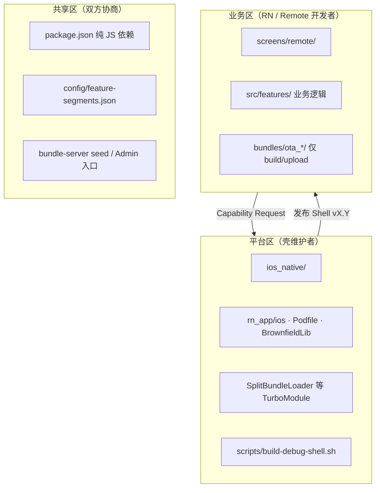
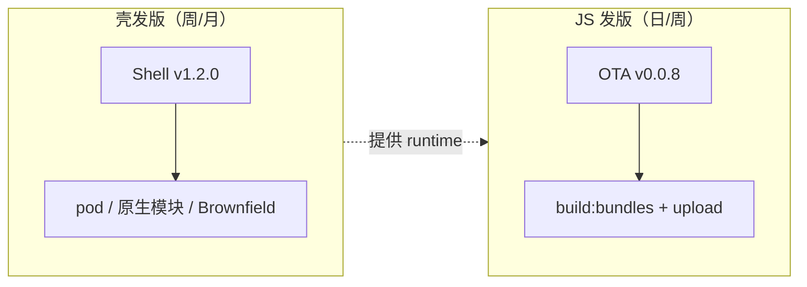

# Brownfield 团队协作机制

**Date:** 2026-07-09  
**Status:** 生效  
**相关：** [SOP 操作手册](./sop.md)、[平台设计方法](./platform-design.md)、[README — 团队开发](../README.md#团队开发壳打一次同事只-npm-start)、[Remote 双路径架构](./dynamic-multi-bundle.md#remote-双路径架构metro-dev--ota-upload)

## 背景

本项目采用 **Brownfield + Split Bundle + OTA**：原生壳（`ios_native`）嵌入 RN 运行时（`BrownfieldLib`），业务 JS 在 `rn_app/` 中开发。

**同事不应：**

- 使用 `npx react-native init` 或自建 RN 工程
- 自行搭建 Xcode / CocoaPods / Brownfield 打包链路
- 在业务 PR 中私自 `pod install` 或升级含 native 代码的 npm 包

**平台（壳维护者）提供：**

- 版本化的 Debug / Release 壳
- 约定好的 `rn_app` 目录结构与开发 SOP
- 已接入的原生能力清单（Capability Catalog）
- 新 Remote 入口脚手架流程（见 [SOP-E](./sop.md#7-sop-e新增-remote-入口端到端)）

**核心原则：**

```text
同事 ≠ 新建 RN 项目
同事 = 在平台提供的 RN 应用脚手架里写 JS，跑在平台发布的壳上
```

---

## 角色与目录边界

### 平台区 vs 业务区



| 角色 | 拥有目录 | 日常动作 |
|------|----------|----------|
| **壳维护者** | `ios_native/`、`rn_app/ios/`、`rn_app/ios/BrownfieldLib/`、`src/specs/`（Codegen） | 发 Shell、审 native 依赖、实现 TurboModule |
| **核心 RN 开发者** | `screens/`（Scheme 1）、`src/` 通用逻辑 | `npm start` + 共享 Debug 壳 |
| **Remote 业务开发者** | `screens/remote/`、`bundles/ota_<id>/` | Metro 日常开发 + OTA 发版 |
| **服务端维护者** | `bundle-server/` | manifest、upload、回滚 |

操作细节见 [SOP §1 角色分工](./sop.md#12-角色分工)、[SOP-F 壳维护与分发](./sop.md#8-sop-f原生壳维护与团队分发)。

### 禁止事项（全员）

| 禁止 | 原因 |
|------|------|
| `npx react-native init` 新建工程 | 与 Brownfield 运行时、module id、OTA split 不兼容 |
| 改 `Podfile` / `rn_app/ios` 不经壳维护者 | 破坏团队共享 Debug 壳一致性 |
| 改 `ios_native` 不经壳维护者 | 导航、权限、壳 UI 由平台统一维护 |
| 主 bundle runtime import `bundles/ota_*` | 破坏 Metro / OTA 双路径隔离 |
| 只改 `bundles/ota_*/` 却等 Metro HMR | OTA 目录不参与 Metro 图 |

---

## 平台交付物（脚手架）

同事拿到的不是 RN CLI，而是以下 **三类交付物**。

### 1. 开发壳（Debug Shell Artifact）

壳维护者构建并分发模拟器 App：

```bash
chmod +x scripts/build-debug-shell.sh
./scripts/build-debug-shell.sh
# 产物：dist/ios_native-debug-simulator.app
```

**建议（待实施）：** 壳版本化命名与 manifest，便于团队对齐：

```text
shell-ios-debug-1.2.0-simulator.app
shell-ios-debug-1.2.0-manifest.json   # RN 版本、pod 清单、构建时间、最低 Xcode
```

### 2. 同事 onboarding（四步）

```bash
# 1. 克隆 monorepo
git clone <repo-url> && cd native-app-multi-rn-bundle

# 2. 安装 RN 依赖并启动 Metro
cd rn_app && npm install && npm start

# 3. 安装壳维护者分发的 Debug 壳（模拟器已启动）
xcrun simctl install booted /path/to/ios_native-debug-simulator.app

# 4. 模拟器桌面打开 ios_native → 自动连本机 Metro
```

同事 **不需要**：Xcode、`pod install`、`brownfield:package:ios`。

### 3. JS 应用脚手架（仓库内约定）

Remote 新入口按 [SOP-E](./sop.md#7-sop-e新增-remote-入口端到端) 手工创建；**建议（待实施）** 提供 CLI：

```bash
npm run scaffold:remote -- --id billing --title "账单"
```

自动生成：`screens/remote/billing/`、`bundles/ota_billing/`、segment 配置、构建列表占位、seed 占位。

日常 UI 开发默认只改 **`screens/remote/`**；OTA 包装页仅在 badge/文案差异时改 **`bundles/ota_*/screens/`**。见 [screens/remote/README.md](../rn_app/screens/remote/README.md)、[bundles/README.md](../rn_app/bundles/README.md)。

---

## 依赖分层

```text
                    ┌─────────────────────────┐
                    │ L3 原生依赖（Pod / SPM） │ ← 仅壳维护者
                    └───────────┬─────────────┘
                                │
                    ┌───────────▼─────────────┐
                    │ L2 JS + Native 库       │ ← 壳维护者评估后纳入壳
                    │ (reanimated, camera…) │
                    └───────────┬─────────────┘
                                │
                    ┌───────────▼─────────────┐
                    │ L1 纯 JS 依赖           │ ← 业务开发者 npm install
                    │ (lodash, zustand…)      │
                    └─────────────────────────┘
```

| 层级 | 谁可添加 | 流程 | 是否重发壳 |
|------|----------|------|------------|
| **L1 纯 JS** | 业务开发者 | PR 改 `package.json`，CI 跑 test | ❌ |
| **L2 含 native 的 npm** | 壳维护者 | Capability Request → pod + 发新 Shell | ✅ |
| **L3 壳 / TurboModule** | 壳维护者 | 设计评审 / OpenSpec → 原生实现 | ✅ |

**判断标准：**

> `npm install xxx` 后是否需要改 `Podfile`、原生注册、或 `Info.plist` 权限？  
> **是 → L2/L3，找壳维护者。否 → L1，业务 PR 即可。**

常见 L2 示例：`react-native-reanimated`、`react-native-vision-camera`、地图/扫码/推送等。

---

## Capability Catalog（能力清单）

业务代码 **只能使用下表已提供的能力**；未列出的 native 能力须提 Capability Request。

| Capability | JS / API | 引入版本 | 说明 |
|------------|----------|----------|------|
| Brownfield 嵌入 | `ReactNativeBrownfield` | 初始 | Debug 连 Metro，Release 内嵌 bundle |
| Scheme 1 本地页 | `AppRegistry` + `moduleName` | 初始 | Home / Profile / Settings |
| Remote FeatureHost | `useFeatureHost` / manifest | 初始 | 远程业务容器 |
| OTA Split 加载 | `SplitBundleLoader.load(path, segmentId)` | 初始 | segment 0 = shared，1+ = feature |
| OTA 公共 split | `ensureSharedBundleCached` | shared split | 先 load shared 再 load feature |
| 回原生菜单 | `NativeShellNavigation.popToNative()` | 初始 | Remote 根页「菜单」 |
| React Navigation | `@react-navigation/*` | shared split | 在 `ota_shared` 中，非主 bundle |
| Gesture Handler / Screens | 已 link | shared split | 导航依赖 |
| 相机 / 蓝牙 / 自定义原生模块 | — | **未提供** | 需 Capability Request |

壳维护者扩能力后 **必须更新本表** 与 Shell CHANGELOG。

---

## Capability Request 流程

### 何时提交

- 需要 L2/L3 依赖或新 TurboModule
- 需要新系统权限（相机、定位、推送等）
- 需要改壳 UI、导航结构、Brownfield 配置

### 提交方式

在 issue 跟踪系统创建 **Capability Request**（GitHub Issue / 飞书工单等），使用下方模板。

### 处理分级（壳维护者 SLA 参考）

| 级别 | 示例 | 壳维护者动作 |
|------|------|--------------|
| **P0 已有能力** | 使用 Navigation、`popToNative` | 指向文档，无需改壳 |
| **P1 纯 JS** | axios、dayjs、zustand | 批准 `package.json` PR |
| **P2 新 native 库** | 地图、扫码、相册 | pod + 权限 + 发 Shell vX.Y+1 |
| **P3 新 TurboModule** | 自定义桥、原生 SDK 封装 | OpenSpec + 原生开发 + 发 Shell |

### 每次发壳必带

- Shell 版本号（建议 semver）
- CHANGELOG：新增/升级/移除的 native 依赖
- **兼容矩阵**：`Shell x.y.z` ↔ `rn_app` 最低 git tag / commit

### Issue 模板（复制使用）

```markdown
## Capability Request

### 业务场景
（为什么要这个能力？）

### 候选方案
- 库名 / SDK：
- npm 链接（如有）：
- 是否纯 JS（你认为）：是 / 否 / 不确定

### 使用范围
- [ ] 仅 Remote OTA split
- [ ] Scheme 1 主 bundle
- [ ] 两者都要

### 平台
- [ ] iOS（优先）
- [ ] Android（后续）

### 期望时间
（可选）

### 验收标准
（可选）
```

---

## 何时重发壳

与 [SOP-F §8.1](./sop.md#81-何时需要重新打壳) 一致：

| 变更 | 重发壳 | 发版通道 |
|------|--------|----------|
| 只改 JS/TS（`screens/remote/`、`src/`） | ❌ | Metro HMR / OTA upload |
| Remote UI 发版 | ❌ | `build:bundles` + upload |
| 新增/升级 **native** npm 依赖 | ✅ | 新 Shell + App |
| 改 `ios_native` 原生代码 | ✅ | 新 Shell |
| 改 `SplitBundleLoader` 等 TurboModule | ✅ | 新 Shell |
| 升级 RN 大版本 / Brownfield 大版本 | ✅ | 新 Shell + 全量回归 |
| 改 Scheme 1 核心页（随主 bundle） | ⚠️ | 需发 App（非 OTA） |



---

## 技术护栏

文档约定需配合工具 enforce，避免误操作。

| 护栏 | 作用 | 状态 |
|------|------|------|
| 目录 README | 标明改哪、哪条路径生效 | ✅ |
| `npm run verify:ota-scope` | 主 bundle 图不含 `bundles/ota_*` | ✅ |
| **`npm run verify:native-deps`** | 生产依赖树中 native 包须在 allowlist | ✅ |
| ESLint / Metro blockList | 禁止错误 import 方向 | 部分 |
| **CODEOWNERS** | 平台目录必须壳维护者 approve | 待实施 |
| **CI 分支保护** | 业务 PR 不可单独改平台区 | 待实施 |
| **Shell 版本 manifest** | 壳过旧时 App 内提示升级 | 待实施 |
| **`npm run scaffold:remote`** | 新 Remote 入口一键脚手架 | 待实施 |

### Native 依赖检测（`verify:native-deps`）

扫描 **`dependencies` 生产依赖树**（含传递依赖），用启发式识别 **含 native 代码的 npm 包**（podspec、`codegenConfig`、`android/` 等）。未列入 allowlist 的 native 包 → **CI / PR 失败**。

| 命令 | 用途 |
|------|------|
| `npm run verify:native-deps` | PR / CI 门禁（失败则打印 Capability Request 指引） |
| `npm run verify:native-deps:audit` | 列出当前树中全部 native 包及 allow 状态 |
| `node scripts/verify-native-deps.js --explain <pkg>` | 调试单个包为何被判为 native |

**Allowlist 文件：** `rn_app/config/approved-native-deps.json`

- `platformPackages` — 平台内置（`react`、`react-native`）
- `approvedNativePackages` — 壳维护者已接入的 L2 native 库

**壳维护者**新增 native 依赖时：同一 PR 内更新 allowlist + pod + 发 Shell。

**业务开发者**新增纯 JS 依赖（如 `zustand`）：无需改 allowlist，`verify:native-deps` 自动放行。

**组合校验：** `npm run verify` = `verify:ota-scope` + `verify:native-deps`。

### CODEOWNERS 示例（待提交）

```text
/ios_native/                    @shell-maintainer
/rn_app/ios/                    @shell-maintainer
/rn_app/ios/BrownfieldLib/      @shell-maintainer
/rn_app/src/specs/              @shell-maintainer
/rn_app/screens/remote/         @remote-team
/rn_app/bundles/                @remote-team
/bundle-server/                 @server-maintainer
```

将 `@shell-maintainer` 等替换为实际 GitHub 团队或用户名。

---

## Remote 双路径（协作默认规则）

对新同事一句话：

> **Remote UI 默认只改 `screens/remote/`；发版跑 `build:bundles` + upload；不要新建 RN 项目；不要自己 pod。**

| 路径 | 改哪里 | 如何验证 |
|------|--------|----------|
| Metro 日常 | `screens/remote/`、`components/` | `npm start` + Debug 壳 |
| OTA 发版 | 同上 + 必要时 `bundles/ota_*/screens/` | `build:bundles` + upload + OTA 模式 |

详见 [dynamic-multi-bundle.md — Remote 双路径](./dynamic-multi-bundle.md#remote-双路径架构metro-dev--ota-upload)。

---

## 实施优先级

| 优先级 | 动作 | 成本 |
|--------|------|------|
| **P0** | 本文档 + Capability 模板 + 能力清单维护 | 低 |
| **P0** | Shell 版本化分发 + 「何时重发壳」宣贯 | 低 |
| **P1** | CODEOWNERS + 平台目录 CI 保护 | 低 |
| **P1** | PR 跑 `npm run verify`（含 native-deps） | 低 |
| **P1** | `npm run scaffold:remote` | 中 |
| **P2** | native 依赖 allowlist CI | 中 |
| **P2** | Shell manifest + App 内版本校验 | 中 |
| **P3** | 拆 repo（业务仓 + shell 制品仓） | 高，团队扩大后再做 |

---

## 参考

- [SOP 操作手册](./sop.md)
- [README — 团队开发](../README.md#团队开发壳打一次同事只-npm-start)
- [dynamic-multi-bundle.md](./dynamic-multi-bundle.md)
- [screens/remote/README.md](../rn_app/screens/remote/README.md)
- [bundles/README.md](../rn_app/bundles/README.md)
- [Callstack Brownfield iOS 文档](https://oss.callstack.com/react-native-brownfield/docs/getting-started/ios)
