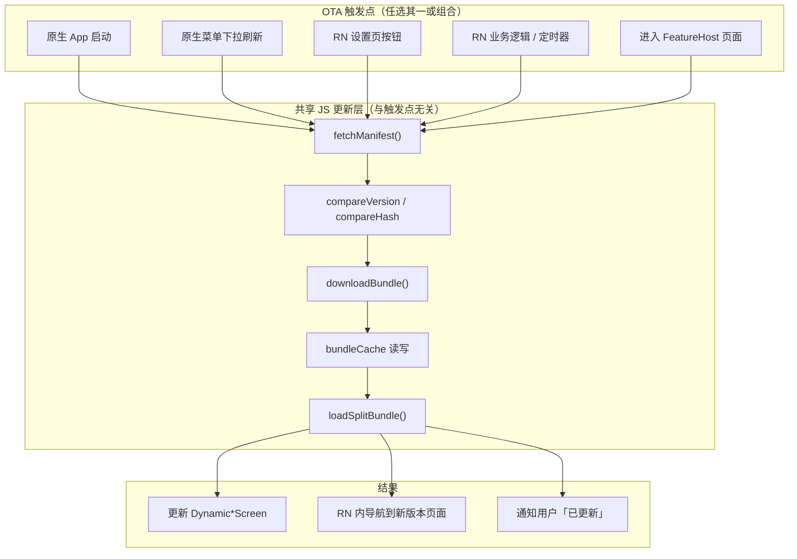
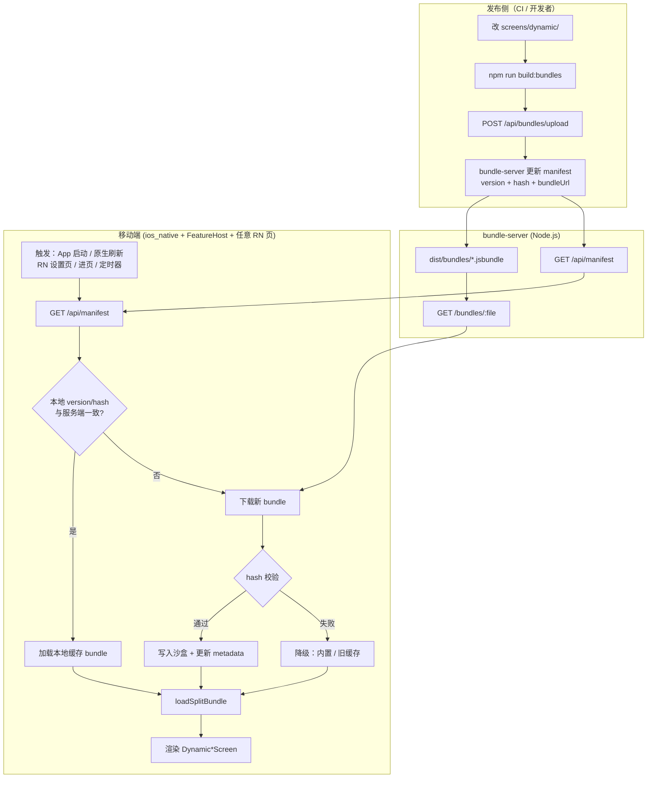
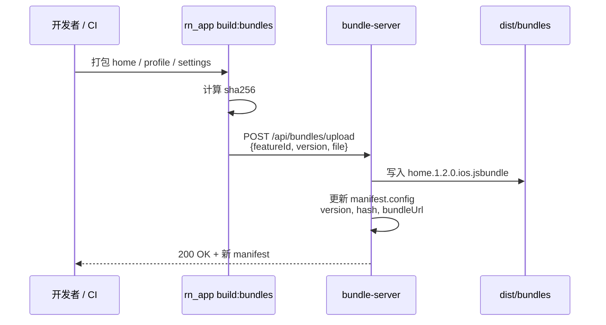
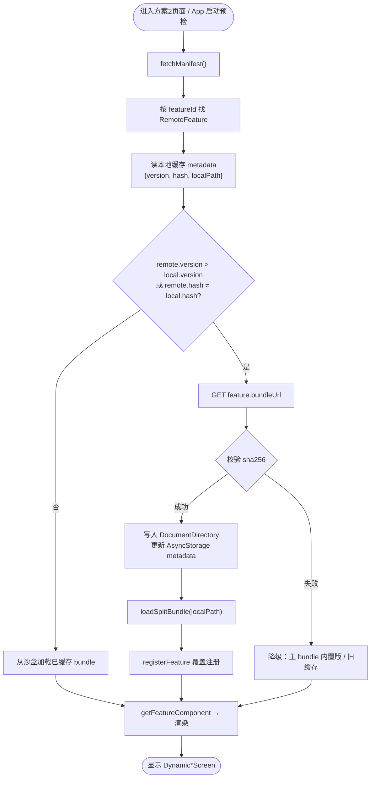
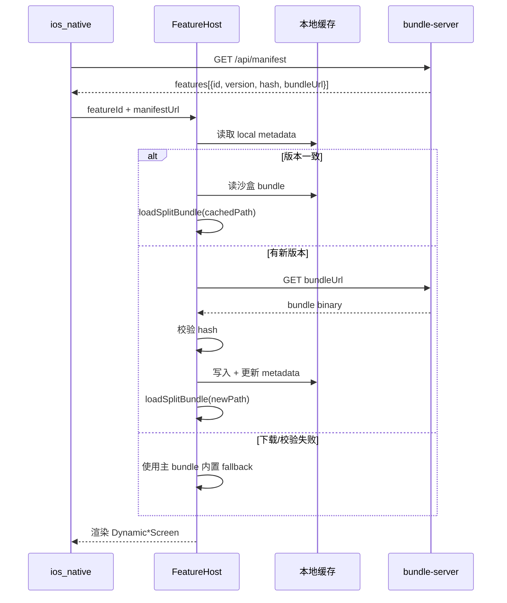
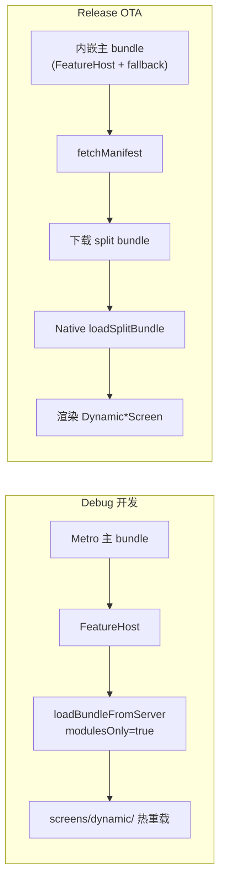
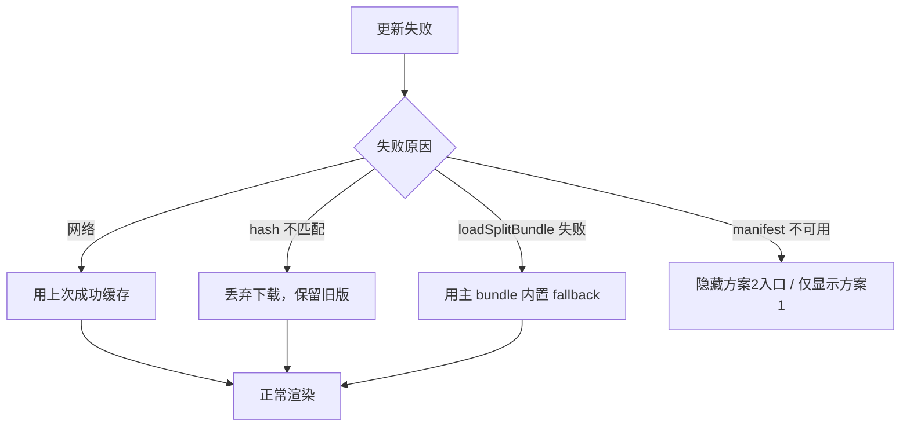

# Dynamic Multi-Bundle

服务端控制 RN 动态入口（**方案 2**）。与 **方案 1**（单 Bundle + 多 moduleName）在原生壳中共存，菜单分两组。

| 分组 | 方案 | 说明 |
|------|------|------|
| React Native · 方案1（单 Bundle） | 方案 1 | 主 bundle 内直接 `moduleName`，无需 bundle-server |
| React Native · 方案2（动态 Bundle） | 方案 2 | manifest 控入口，按需加载子 bundle |

## 架构

```
bundle-server (Node.js)
  GET /api/manifest          → 返回启用的 feature 列表 + bundleUrl
  GET /bundles/*.jsbundle    → 静态子 bundle（Release / 联调）

rn_app
  screens/                   → 方案1 页面（HomeScreen / ProfileScreen / SettingsScreen）
  screens/dynamic/           → 方案2 独立页面（DynamicHomeScreen 等）
  index.js                   → 主 bundle：方案1 注册 + 方案2 dynamicFeatures
  bundles/{home,profile,settings}/index.js → 方案2 子 bundle 入口
  src/features/FeatureHost   → 拉 manifest → 下载 bundle → 渲染页面

ios_native
  LocalReactNativeScreenView   → 方案1：直接 moduleName
  DynamicReactNativeScreenView → 方案2：FeatureHost + featureId
  BundleManifestService        → 方案2 菜单动态读取 manifest
```

## 快速开始

### 1. 启动 bundle-server

```bash
cd bundle-server
npm install
npm start
```

Manifest 地址：`http://127.0.0.1:3001/api/manifest`

### 2. 开发模式（Metro 热重载子 bundle）

```bash
# 终端 1 — Metro
cd rn_app && npm start

# 终端 2 — bundle-server（指向 Metro）
cd bundle-server
USE_METRO_BUNDLES=true npm start

# 终端 3 — Xcode Debug Run ios_native
```

此模式下 manifest 里的 `bundleUrl` 会指向 Metro 的 split bundle 路径，改 `screens/dynamic/` 可热重载。

### 3. 静态 bundle 模式（接近 Release）

```bash
# 构建全部 bundle 到 bundle-server/dist/bundles/
cd rn_app
npm run build:bundles

# 启动静态服务
cd ../bundle-server
npm start

# Xcode Run（Debug 连 Metro 主 bundle + 静态子 bundle，或 Release 全静态）
```

### 4. 服务端控制入口

编辑 `bundle-server/manifest.config.js`，将某个 feature 的 `enabled` 设为 `false`，重启 server（或使用 API）后，原生菜单会自动隐藏该入口。

```bash
# 运行时切换（示例：关闭 settings）
curl -X POST http://127.0.0.1:3001/api/features/settings/toggle \
  -H 'Content-Type: application/json' \
  -d '{"enabled": false}'
```

下拉刷新原生壳菜单即可看到变化。

## 新增一个 RN 页面（方案 2）

1. 在 `rn_app/screens/dynamic/` 添加页面组件（不要用方案 1 的 `screens/`）
2. 在 `screens/dynamic/index.ts` 的 `dynamicFeatures` 里注册
3. 新建 `rn_app/bundles/<id>/index.js` 并 `registerFeature`
4. 在 `bundle-server/manifest.config.js` 注册 feature
5. 在 `rn_app/scripts/build-bundles.js` 的 `bundles` 数组里加一项
6. `npm run build:bundles`

## 关键文件

| 文件 | 说明 |
|------|------|
| `bundle-server/manifest.config.js` | 服务端入口配置（启用/禁用、bundle 文件名） |
| `bundle-server/server.js` | Express 服务 |
| `rn_app/src/features/FeatureHost.tsx` | RN 动态加载容器 |
| `rn_app/screens/dynamic/` | 方案 2 独立页面（与方案 1 分离） |
| `rn_app/src/features/bundleLoader.ts` | 下载并加载子 bundle（Dev: Metro split） |
| `ios_native/ios_native/BundleManifestService.swift` | 原生拉 manifest、动态菜单 |

---

## OTA 热更新

方案 2 的最终目标是：**RN 子 bundle 打包后上传到 Node 服务，移动端自动拉 manifest、比对版本、下载并加载新 bundle**，无需发版原生 App。

> **当前状态：** 架构与分发路径已就绪（manifest + 静态托管 + FeatureHost），**完整 OTA 链路（版本比对、本地缓存、上传 API、Release 安全加载）待实现**。下表与流程图为目标设计。

### 能力对照

| 能力 | 状态 | 说明 |
|------|------|------|
| Node 服务托管 bundle | ✅ 已有 | `bundle-server/dist/bundles/` + `GET /bundles/*.jsbundle` |
| manifest 动态入口 | ✅ 已有 | `GET /api/manifest` 控制显示哪些页面 |
| 移动端拉 manifest | ✅ 已有 | `BundleManifestService` + `FeatureHost` |
| Dev 增量 bundle | ✅ 已有 | Metro `modulesOnly=true` |
| manifest 版本字段 | ❌ 待做 | per-feature `version` / `hash` / `minAppVersion` |
| 本地缓存 | ❌ 待做 | 沙盒持久化 bundle + metadata |
| 上传 API | ❌ 待做 | `POST /api/bundles/upload`，替代手动拷贝 `dist/` |
| Release 热加载 | ❌ 待做 | Native `loadSplitBundle`，禁止对完整 bundle `eval` |

### OTA 触发点：原生端 vs RN 页面内

**可以。** OTA 的核心逻辑（拉 manifest → 比对版本 → 下载 bundle → 加载）都在 **JS 层**（`FeatureHost` / `bundleLoader` / 未来的 `bundleCache`），并不绑定原生壳。原生端和 RN 页面内都可以触发同一套更新流程。

| 触发位置 | 典型场景 | 当前实现 | 说明 |
|----------|----------|----------|------|
| **原生壳** | App 启动预检、菜单下拉刷新、推送触达 | ✅ `BundleManifestService` | 控制方案 2 **入口列表**是否展示 |
| **RN 页面内** | 设置页「检查更新」、进页前静默更新、业务事件触发 | 🔜 共用 JS API | 控制**已打开页面**或**其他 feature** 的 bundle 是否更新 |
| **FeatureHost 内部** | 进入某个动态页时自动比对 | ✅ 部分已有 | 进页时 `fetchManifest` + 加载 |



**关键原则：**

1. **原生负责「门」** — 是否在菜单里展示某个 RN 入口（manifest 里 `enabled`）
2. **RN 负责「内容」** — 某个 feature 的 bundle 版本是否最新、何时拉取、何时 reload
3. **同一 Runtime** — 无论从哪里触发，都在同一个 Brownfield JS Runtime 里加载 split bundle，不能重复 `eval` 完整包

**RN 页面内触发的典型用法（待实现 `bundleUpdater` API）：**

```typescript
// 任意 RN 页面（方案1 或 方案2 均可调用）
import { checkAndUpdateFeature } from '../features/bundleUpdater';

// 用户点击「检查更新」
await checkAndUpdateFeature('profile', {
  onUpdateAvailable: (version) => showToast(`发现新版本 ${version}`),
  onUpdated: () => navigation.replace('FeatureHost', { featureId: 'profile' }),
});

// 静默预加载：首页加载完成后，后台更新其他 feature
useEffect(() => {
  preloadFeatures(['profile', 'settings']);
}, []);
```

**RN 内 OTA vs 原生 OTA 的区别：**

| | 原生端触发 | RN 页面内触发 |
|---|-----------|---------------|
| 更新 manifest 菜单 | ✅ 适合 | ❌ 不适用（菜单是 SwiftUI） |
| 更新当前 RN 页 bundle | 进页时被动触发 | ✅ 适合主动检查 / 静默更新 |
| 预加载其他 feature | 需额外桥接 | ✅ 自然适合 |
| 更新后 UI 反馈 | 需通知 RN | ✅ 直接 setState / 弹窗 |

> 实施 OTA 时，建议把 `fetchManifest`、`compareVersion`、`downloadBundle`、`loadSplitBundle` 抽成独立的 `bundleUpdater.ts`，原生和 `FeatureHost`、任意 RN 页面共用，避免逻辑重复。

### 整体架构



### 发布流程（服务端）



**目标上传接口（待实现）：**

```bash
curl -X POST http://127.0.0.1:3001/api/bundles/upload \
  -F "featureId=home" \
  -F "version=1.2.0" \
  -F "file=@bundle-server/dist/bundles/home.ios.jsbundle"
```

### 移动端更新流程





### 目标 manifest 结构

```json
{
  "version": 2,
  "updatedAt": "2026-07-08T12:00:00.000Z",
  "manifestUrl": "https://cdn.example.com/api/manifest",
  "features": [
    {
      "id": "home",
      "title": "首页",
      "icon": "house",
      "moduleName": "DynamicHomeScreen",
      "version": "1.2.0",
      "hash": "sha256:abc123...",
      "bundleUrl": "https://cdn.example.com/bundles/home.1.2.0.ios.jsbundle",
      "minAppVersion": "1.0.0",
      "enabled": true
    }
  ]
}
```

| 字段 | 用途 |
|------|------|
| `version` | 语义化版本，移动端比对是否需要更新 |
| `hash` | bundle 文件 sha256，下载后校验完整性 |
| `bundleUrl` | 该版本 bundle 的 CDN / 服务地址 |
| `minAppVersion` | 低于此原生版本则不下发（避免 native 不兼容） |

### 本地缓存设计（待实现）

```
DocumentDirectory/rn-bundles/
  home/
    1.2.0.jsbundle          # bundle 文件
    metadata.json           # { version, hash, installedAt }
  profile/
    ...
```

```json
// metadata.json
{
  "featureId": "home",
  "version": "1.2.0",
  "hash": "sha256:abc123...",
  "localPath": ".../home/1.2.0.jsbundle",
  "installedAt": "2026-07-08T12:00:00.000Z"
}
```

### Dev vs Release 加载方式



| 环境 | 主 bundle 来源 | 子 bundle 来源 | 注意 |
|------|----------------|----------------|------|
| Debug + Metro | Metro `index.js` | Metro split（`USE_METRO_BUNDLES=true`） | 改 `screens/dynamic/` 可热重载 |
| Debug + 静态 | Metro 或内嵌 | `bundle-server` 静态文件 | 联调分发路径 |
| Release OTA | App 内嵌 BrownfieldLib | CDN / bundle-server 下载 | **必须** split bundle 加载，不能 `eval` 完整包 |

> **为什么不能 eval 完整 bundle？** 每个完整 bundle 都包含一份 React，eval 进同一 Runtime 会导致 `useSyncExternalStore of null` 等 hooks 错误。Release 必须使用增量 split bundle 或 Native `loadAndExecuteSplitBundleURL`。

### 降级策略



### 实施路线图

| 阶段 | 内容 | 产出 |
|------|------|------|
| **P0** | manifest 增加 `version` / `hash` | 服务端字段 + RN 类型定义 |
| **P1** | `POST /api/bundles/upload` | 上传后自动更新 manifest |
| **P2** | 移动端 `bundleCache.ts` | 下载、校验、沙盒读写、metadata |
| **P3** | iOS `SplitBundleLoader` Native Module | Release 下 `loadSplitBundle` |
| **P4** | App 启动预检 + 静默更新 | 进页面前 bundle 已就绪 |
| **P5** | 灰度 / 按原生版本下发 | manifest 规则引擎 |

### 与现有代码的对应

| OTA 步骤 | 现有实现 | 待扩展 |
|----------|----------|--------|
| 打包 | `npm run build:bundles` | 打包时输出 hash |
| 上传 | 手动拷贝到 `dist/` | `POST /api/bundles/upload` |
| 下发 manifest | `GET /api/manifest` | 增加 version/hash 字段 |
| 原生菜单 | `BundleManifestService` | 不变 |
| 加载页面 | `FeatureHost` + 主 bundle registry | 增加缓存比对 + split 加载 |
| RN 内触发 OTA | 未实现 | 抽取 `bundleUpdater.ts` 供任意 RN 页调用 |
| 降级 | 主 bundle 内置 dynamic features | 明确 fallback 优先级 |

---

## 说明

- **方案 1** 只依赖 Metro / 主 bundle，适合日常开发、server 不可用时的兜底。
- **方案 2** 使用 `screens/dynamic/` 独立页面；服务端 manifest 控制**入口可见性**；主 bundle 内注册 dynamic features（与方案 1 共享 React 实例，避免 hooks 报错）。
- 子 bundle 文件面向 OTA；Dev 下通过 Metro `modulesOnly=true` 懒加载。
- **Release OTA** 见上文 [OTA 热更新](#ota-热更新) 章节；当前静态 bundle 模式主要用于联调分发路径。
- Debug 默认主 bundle 连 Metro（`preferEmbeddedBundleInDebug = false`）。
- 模拟器访问本机服务使用 `127.0.0.1`；真机需改为电脑局域网 IP。
- 多 bundle 使用 deterministic moduleId（见 `metro.config.js`），保证主/子 bundle 模块 ID 一致。

更多背景见 [multi-bundle.md](./multi-bundle.md)。
