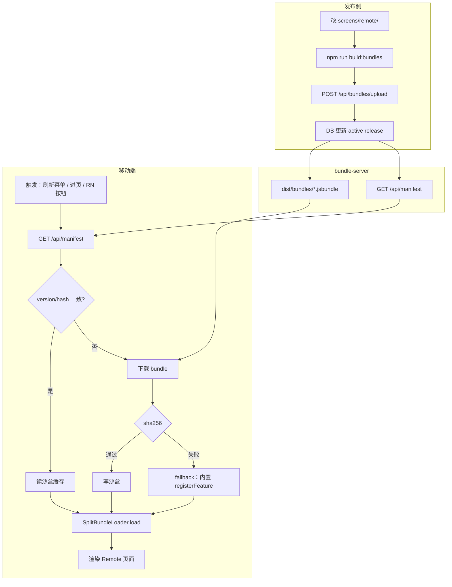

# Remote RN · 远程业务块（Split Bundle + OTA）

服务端配置 **Remote 入口**（远程 RN 业务块），支持 manifest 增删、子 bundle 按需加载与 OTA 热更新。与 **Scheme 1 核心 RN**（本地固定页面）在原生壳中共存，菜单分两组。

> **术语：** 本文档中的 **「方案 2」** 仅指 **Split Bundle + manifest + FeatureHost** 这套**技术实现**，不是菜单上的第二组页面名称。产品上第二组应称为 **「远程业务 / Remote entries」**。

## 术语对照

| 名称 | 层级 | 含义 |
|------|------|------|
| **Scheme 1 · 核心 RN** | 产品 | 本地固定入口：`HomeScreen` / `ProfileScreen` / `SettingsScreen`。主 bundle 直接 `moduleName`，**不走 manifest / OTA** |
| **Remote entry · 远程入口** | 产品 | 服务端配置的 RN 业务页（目标：`order`、`promo` 等）。manifest 控制可见性、版本、bundle URL，**可 OTA** |
| **Scheme 2 · Split Bundle** | 技术 | 在同一 Brownfield Runtime 内 lazy load 子 bundle + `FeatureHost` + OTA，**用来交付 Remote 入口** |
| **multi-bundle 方案三** | 技术 | Re.Pack Module Federation — **不在当前范围** |
| **multi-bundle 方案四** | 技术 | 多 RN 工程 / 多 XCFramework — **不在当前范围**（除非 Remote 业务需要不同 RN 版本） |

**关键规则：**

1. OTA 只作用于 **Remote 入口**，不影响 Scheme 1 核心页
2. Remote 入口**不必**与 Scheme 1 一一对应（不是「远程版首页」）
3. Remote 与 Scheme 1 共用 **同一个** `rn_app`、同一个 BrownfieldLib、同一个 JS Runtime

### 原生壳菜单（目标形态）

```
Native Shell
├── 原生页面
├── React Native · 核心 RN（Scheme 1）     ← 本地固定
└── React Native · 远程业务（Remote）      ← manifest 动态 + OTA
```

> **Demo 技术债：** 已迁移至 `screens/remote/`（`order`、`promo`）。旧 `screens/dynamic/Dynamic*` 镜像页面已移除。

## 架构

```
bundle-server (Fastify + Prisma)
  GET /api/manifest          → 启用的 Remote 入口 + version/hash/bundleUrl
  POST /api/bundles/upload   → 上传子 bundle，更新 active release
  GET /bundles/*.jsbundle    → 静态子 bundle

rn_app
  screens/                   → Scheme 1 核心页
  screens/remote/            → Remote 业务页（OrderScreen、PromoScreen）
  index.js                   → 主 bundle：Scheme 1 注册 + Remote registerFeature fallback
  bundles/{order,promo}/     → Remote 子 bundle 入口
  src/features/
    FeatureHost              → Remote 容器：manifest → OTA → 渲染
    bundleUpdater            → 版本比对、下载、缓存
    bundleCache              → 沙盒持久化
    bundleLoader             → Dev Metro split / Release SplitBundleLoader

ios_native
  LocalReactNativeScreenView     → Scheme 1：直接 moduleName
  DynamicReactNativeScreenView   → [deprecated alias] RemoteReactNativeScreenView
  RemoteReactNativeScreenView    → Remote：FeatureHost + featureId
  BundleManifestService        → Remote 菜单动态读取 manifest
```

## 快速开始

### 1. 启动 bundle-server

```bash
cd bundle-server
npm install
npm run dev          # db:prepare + 热重载
```

| 地址 | 说明 |
|------|------|
| http://127.0.0.1:3001/admin | 管理后台：上传、回滚、启用/禁用入口 |
| http://127.0.0.1:3001/api/manifest | Remote manifest JSON |

`npm run dev` 会自动 `prisma db push` + seed。数据库：`data/bundle-server.db`。

### 2. 上传与回滚

1. 打开 `/admin`
2. 选择 Remote 入口，填写 semver，上传 `.jsbundle`
3. 勾选「上传后立即上线」，或在历史版本里 **设为线上** / **回滚**
4. 原生壳下拉刷新 Remote 菜单；进入页面时 `FeatureHost` 拉 OTA

```bash
# 回滚示例（目标 entryId：order）
curl -X POST http://127.0.0.1:3001/api/features/order/rollback \
  -H 'Content-Type: application/json' \
  -d '{"releaseId": "<release-id>"}'

# CI 上传示例
./scripts/upload-bundle.sh order 1.0.0 dist/bundles/order.1.0.0.ios.jsbundle
```

### 3. 开发模式（Metro 热重载 Remote 子 bundle）

```bash
# 终端 1 — Metro
cd rn_app && npm start

# 终端 2 — bundle-server 指向 Metro
cd bundle-server && USE_METRO_BUNDLES=true npm run dev

# 终端 3 — Xcode Debug Run ios_native
```

此模式下 manifest 里的 `bundleUrl` 会指向 Metro 的 split bundle 路径，改 `screens/remote/` 可热重载。

### 4. 静态 bundle 模式（接近 Release）

```bash
cd rn_app && npm run build:bundles    # 输出 build-manifest.json + hash
cd ../bundle-server && npm run dev
```

### 5. 服务端控制 Remote 入口可见性

Admin 禁用入口，或：

```bash
curl -X POST http://127.0.0.1:3001/api/features/promo/toggle \
  -H 'Content-Type: application/json' \
  -d '{"enabled": false}'
```

下拉刷新原生壳 Remote 菜单即可。

## 新增一个 Remote 入口

1. 在 `rn_app/screens/remote/` 添加页面（**不要**放进 Scheme 1 的 `screens/`）
2. 在 `screens/remote/index.ts` 的 `remoteFeatures` 注册（主 bundle fallback）
3. 新建 `rn_app/bundles/<entryId>/index.js` 并 `registerFeature`
4. 在 Admin 或 `POST /api/features` 注册 Remote 入口（**待实现** create API；当前可改 `prisma/seed.ts`）
5. 在 `scripts/build-bundles.js` 的 `bundles` 数组加一项
6. `npm run build:bundles` → Admin 或 `upload-bundle.sh` 上传

## 迁移到 Remote 模型

| 之前（demo） | 当前 |
|-------------|------|
| seed: `home` / `profile` / `settings` | seed: `order` / `promo` |
| `screens/dynamic/Dynamic*Screen` | `screens/remote/OrderScreen` 等 |
| 菜单「方案2（动态 Bundle）」 | 菜单「远程业务（Remote）」 |

## App 启动预加载（可选）

**默认：** 仅 Swift `BundleManifestService` 在 `.task` / 下拉刷新时拉 manifest，控制 Remote **菜单**。

**可选 JS 预加载：** 在任意已加载的 RN 页面（如 Scheme 1 首页或 Remote 页）调用：

```typescript
import { preloadFeatures } from './src/features/bundleUpdater';

useEffect(() => {
  preloadFeatures(['order', 'promo']);
}, []);
```

无需原生改动；`FeatureHost` 进页时仍会 `checkAndUpdateFeature`。原生 startup hook 非必须。

## 验证脚本

**先在一个终端启动 server**（smoke 脚本不会自动启动）：

```bash
cd bundle-server && npm run dev
```

**再在另一个终端：**

```bash
cd bundle-server
npm run db:seed                 # Remote 入口 order/promo
npm run smoke:manifest          # manifest v2 字段

# 需先 build bundles
cd ../rn_app && npm run build:bundles
cd ../bundle-server && npm run smoke:e2e
```

若 server 未运行，脚本会提示：`Start it first: cd bundle-server && npm run dev`

| 场景 | 验证方式 |
|------|----------|
| 8.1 上传后 manifest 版本 bump | `npm run smoke:e2e` |
| 8.2 服务端不可用 fallback | 停 server，进 Remote 页应显示主 bundle 内置页 |
| 8.3 Dev Metro split | `USE_METRO_BUNDLES=true npm run dev` + Metro |

## 关键文件

| 文件 | 说明 |
|------|------|
| `bundle-server/prisma/schema.prisma` | Remote 入口 + 版本历史 |
| `bundle-server/src/services/manifest.service.ts` | manifest v2（version/hash） |
| `bundle-server/src/services/bundle.service.ts` | 上传、激活、回滚 |
| `bundle-server/scripts/smoke-manifest.js` | manifest v2 冒烟测试 |
| `rn_app/src/features/bundleUpdater.ts` | OTA 比对 / 下载 / 缓存 |
| `rn_app/src/features/bundleCache.ts` | 沙盒路径与 metadata |
| `rn_app/src/features/bundleLoader.ts` | Dev Metro / Release SplitBundleLoader |
| `rn_app/src/features/FeatureHost.tsx` | Remote 页面容器 |
| `rn_app/ios/BrownfieldLib/SplitBundleLoader.mm` | Release split load |
| `ios_native/.../BundleManifestService.swift` | Remote 菜单 |

---

## OTA 热更新

**目标：** Remote 子 bundle 打包上传到 Node 服务 → 移动端拉 manifest → 比对版本 → 下载 → 校验 hash → 沙盒缓存 → split load，**无需 App Store 发版**。

> **当前状态：** 服务端 manifest v2、上传、Admin、回滚已就绪。客户端 `bundleCache` / `bundleUpdater` / `SplitBundleLoader` 已实现；**Remote 模型重构**（§9）与 BrownfieldLib 重打包验证仍进行中。

### 能力对照

| 能力 | 状态 | 说明 |
|------|------|------|
| Node 托管 bundle | ✅ 已有 | `dist/bundles/` + `GET /bundles/*` |
| manifest Remote 入口 | ✅ 已有 | `GET /api/manifest` |
| manifest version/hash | ✅ 已有 | manifest v2 |
| 上传 + Admin + 回滚 | ✅ 已有 | Prisma `BundleRelease` |
| 原生 Remote 菜单 | ✅ 已有 | `BundleManifestService` |
| Dev Metro split | ✅ 已有 | `modulesOnly=true` |
| 客户端缓存 | ✅ 已有 | `bundleCache.ts` + RNFS；未链接时降级主 bundle |
| 版本比对 / 下载 | ✅ 已有 | `bundleUpdater.ts` |
| Release split load | ✅ 已有 | `SplitBundleLoader`（需重打 BrownfieldLib） |
| 新建 Remote 入口 API | ✅ 已有 | `POST /api/features` + Admin 表单 |
| Remote 页面 / seed | ✅ 已有 | `order` / `promo` |

### OTA 作用范围

| 对象 | 是否 OTA |
|------|----------|
| Scheme 1 核心页（HomeScreen 等） | ❌ |
| 主 bundle / BrownfieldLib | ❌（需原生发版） |
| Remote 入口子 bundle | ✅ |
| Remote 菜单可见性 | ✅（manifest `enabled`，非 bundle OTA） |

### OTA 触发点

| 触发位置 | 控制什么 | 实现 |
|----------|----------|------|
| 原生下拉刷新 | Remote **菜单**是否展示 | `BundleManifestService.load()` |
| 进入 Remote 页 | **bundle 内容**是否最新 | `FeatureHost` → `checkAndUpdateFeature` |
| Remote 页内按钮 | 手动检查更新 | `bundleUpdater` |
| 静默预加载 | 后台下载其他 Remote bundle | `preloadFeatures([...])` |

**原则：**

1. **原生管「门」** — manifest 决定 Remote 入口是否出现在菜单
2. **JS 管「内容」** — 版本比对、下载、split load 都在 JS 层
3. **同一 Runtime** — 禁止 Release 下 `eval` 完整 bundle（会 duplicate React）

```typescript
import { checkAndUpdateFeature, preloadFeatures } from '../features/bundleUpdater';

// Remote 页内「检查更新」
await checkAndUpdateFeature('order');

// 静默预加载
preloadFeatures(['order', 'promo']);
```

### 整体架构



### 目标 manifest 示例

```json
{
  "version": 2,
  "updatedAt": "2026-07-08T12:00:00.000Z",
  "manifestUrl": "http://127.0.0.1:3001/api/manifest",
  "features": [
    {
      "id": "order",
      "title": "订单",
      "icon": "cart",
      "moduleName": "OrderScreen",
      "version": "1.2.0",
      "hash": "sha256:abc123...",
      "bundleUrl": "http://127.0.0.1:3001/bundles/order.1.2.0.ios.jsbundle",
      "minAppVersion": "1.0.0"
    }
  ]
}
```

### 本地缓存

```
DocumentDirectory/rn-bundles/
  order/
    1.2.0.jsbundle
    metadata.json
```

### Dev vs Release

| 环境 | 主 bundle | Remote 子 bundle | 注意 |
|------|-----------|------------------|------|
| Debug + Metro | Metro | Metro split（`USE_METRO_BUNDLES=true`） | 可热重载 |
| Release OTA | 内嵌 BrownfieldLib | 下载 + `SplitBundleLoader` | **禁止 eval 完整包** |

> **为什么不能 eval 完整 bundle？** 每份完整 bundle 含一份 React，eval 进同一 Runtime 会导致 `useSyncExternalStore of null`。Release 必须用增量 split bundle。

### 降级策略

1. 网络失败 → 用上次成功缓存
2. hash 不匹配 → 丢弃下载，保留旧版
3. split load 失败 → 主 bundle 内置 `registerFeature` fallback
4. manifest 不可用 → Remote 菜单为空；Scheme 1 不受影响

---

## 说明

- **Scheme 1** 只依赖主 bundle，server 不可用时仍可用
- **Remote** 使用 Split Bundle 技术（方案 2）；manifest 管入口，OTA 管 bundle 内容
- 主 bundle 内 `registerFeature` 仅作 offline / 首次安装 fallback
- Debug 默认连 Metro（`preferEmbeddedBundleInDebug = false`）
- 模拟器用 `127.0.0.1`；真机改局域网 IP
- moduleId 见 `metro.config.js` deterministic factory

更多背景：[multi-bundle.md](./multi-bundle.md)
