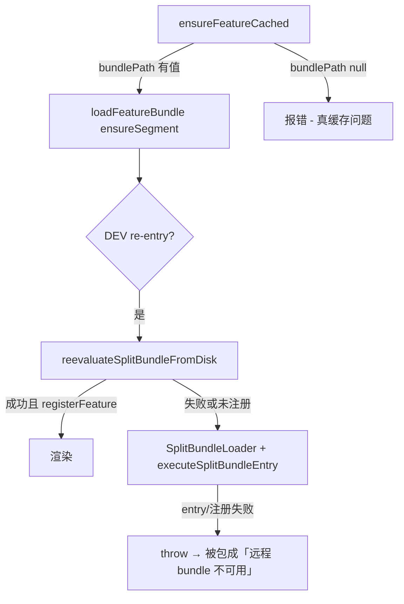

# OTA 第二次进入「远程 bundle 不可用」分析

> **📋 排查笔记（非最终方案）**  
> 最终结论与面试口述见：[docs/interview/ota-reentry-case-study.md](../interview/ota-reentry-case-study.md)  
> 下文部分假设（如 legacy「native 不 re-eval」、full eval 路径）已在 Bridgeless 验证后修正。

**Date**: 2026-07-09  
**Status**: Investigation (superseded by interview case study)  
**Scope**: OTA re-entry、FeatureHost 错误展示、bundleLoader

---

## 先下结论

**服务端 v0.0.6、本地 v0.0.6 一致，基本可以排除「bundle 没下载 / 被删 / 版本对不上」。**

这条文案是**通用错误壳**，真实失败多半发生在 **split bundle 加载 / 注册** 阶段，而不是 manifest 或磁盘缓存阶段。

---

## 这条错误从哪来

UI 文案来自 `formatRemoteBundleError`：

```80:96:rn_app/src/features/bundleUpdater.ts
export function formatRemoteBundleError(featureId: string, cause?: string): string {
  const base = `远程 bundle 不可用（服务端 ota_${featureId} 可能已删除或未 upload）。请重新 upload 后再试。`;
  // ...
  return base;
}
```

第二次进入时在 `catch` 里**所有**加载错误都会被包成同一句：

```250:252:rn_app/src/features/useFeatureHost.ts
          setError({
            message: formatRemoteBundleError(featureId, raw),
            ...versions,
          });
```

所以页面上看不到真正的 `raw` 原因（例如 `split bundle entry failed`、`not registered` 等）。

版本号来自 `resolveOtaVersionContext`：读 manifest 的 remote + 沙盒 metadata 的 local。**即使 load 失败，只要 metadata 还在，就会显示 v0.0.6 / v0.0.6。**

---

## 失败发生在哪一阶段



第一次能进、第二次失败 → 高概率卡在 **B 阶段（load / register）**，不是 **A 阶段（缓存 / 下载）**。

---

## 第二次进入的可能原因（按概率）

### 1. Split segment 二次加载 + 入口 `__r` 失败（最可能）

Native `registerSegmentWithId` 对同一 segment **不会 re-eval**。第二次进入时：

- `clearFeatureRegistration` 清掉了 JS registry
- Native segment 仍在
- 只跑 `executeSplitBundleEntry` → `__r(entry)` 可能失败

抛出：`split bundle entry failed` 或 `not registered` → 被 UI 包成「远程 bundle 不可用」。

---

### 2. DEV re-entry 的 full eval 失败（v0.0.6 风险更高）

第二次进入会走 `reevaluateSplitBundleFromDisk`（full eval 整个 bundle）：

```119:132:rn_app/src/features/bundleLoader.ts
  if (__DEV__ && otaReentry) {
    const reevaluated = await reevaluateSplitBundleFromDisk(path, segmentId);
    if (reevaluated && isFeatureLoadedFromOta(feature.id)) {
      // 成功则 return
    }
  }
  // 否则 fallback 到上面第 1 条路径
```

v0.0.6 的 bundle ~282KB，含 React Navigation 等依赖。Full eval 可能：

- `Requiring unknown module "…"`
- React 重复 / hooks 冲突
- eval 抛错但被 `catch` 吞掉，只打 `[bundleLoader] split bundle re-eval failed: …`

然后 fallback 到第 1 条路径，仍然失败。

---

### 3. Re-eval 成功但未 `registerFeature`

`reevaluateSplitBundleFromDisk` 在 eval **没 throw** 时就返回 `true`，即使末尾 `__r(entry)` 没跑到或 `registerFeature` 没执行。

此时 `isFeatureLoadedFromOta` 为 false → 继续走 native load + entry → 仍可能失败。

---

### 4. Metro 残留状态（你的复现路径）

Metro → OTA 第一次 OK → 第二次 OTA 失败：

- Metro 可能污染 module 表 / Fast Refresh 状态
- 第一次 OTA 标记了 `wasOtaFeatureLoadedThisSession` → 第二次强制 re-eval
- 与第 2、3 条叠加

---

### 5. 真·缓存问题（相对不太可能）

若本地文件被删、`isCachedBundleUsable` 失败、metadata 与文件不一致，会在 `ensureFeatureCached` 阶段就 `bundlePath = null`。

但你第一次已成功、版本仍显示 v0.0.6，说明 metadata 和文件大概率还在。

---

### 6. 主包 vs split module id 不一致（Metro `--reset-cache`）

若 Metro 用了 `--reset-cache`，主包 module id 变了，而 OTA split 是旧主包 build 的：

- 第一次有时能「碰巧」加载
- 第二次 re-eval / re-entry 更容易炸

需重新 `build:bundles` + upload，且 Metro 不要 reset-cache 后混用旧 split。

---

### 7. UI 误导（一定存在）

`formatRemoteBundleError` **无论真实原因都返回同一句**，所以看起来像 upload 问题，实际是 load/register 问题。

---

## 怎么快速确认是哪一种

在 Xcode / Metro 日志里搜这些关键字：

| 日志 | 含义 |
|------|------|
| `[SplitBundleLoader] load ... otaReentry=true` | 第二次进入，走了 re-entry 路径 |
| `[bundleLoader] split bundle re-eval failed:` | full eval 失败（看后面具体原因） |
| `split bundle entry __r(...) failed` | 入口 module 加载失败 |
| `not registered` | bundle 加载了但 `registerFeature` 没执行 |
| `Requiring unknown module` | module 表 / segment 映射问题 |

也可在报错页面临时加一行展示 `raw` 错误（当前被 `formatRemoteBundleError` 吃掉了）。

---

## 小结

| 判断 | 说明 |
|------|------|
| 版本一致 | 缓存/metadata 基本正常，**不是**「没 upload」 |
| 第二次才失败 | 典型 **segment 不 re-eval + registry 被清** 或 **re-eval fallback 失败** |
| v0.0.6 | bundle 更大，re-eval 路径风险比 0.0.1 高 |
| 当前 UI | **掩盖真实错误**，需要看 console 才能定位 |

---

## 后续开发方向

1. 改进错误展示：版本一致时露出 `raw` 原因，区分「缓存问题」与「load/register 问题」
2. 加固第二次 re-entry：避免对大 bundle 做 harmful full eval；保留 segment + entry 路径
3. 必要时 native 层 force re-eval segment（Release 场景）
