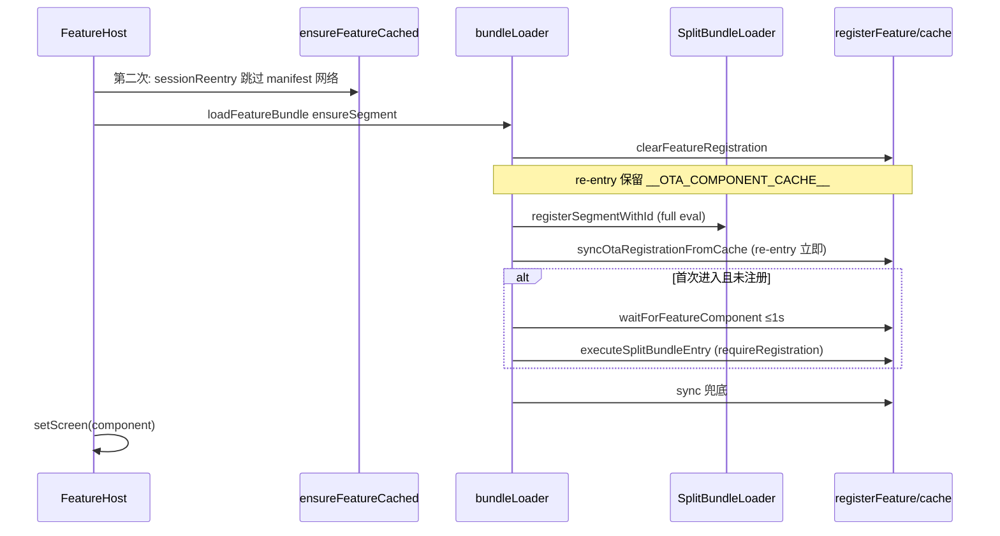

# 面试案例：Brownfield OTA Split Bundle 重复进入

> **用途**：面试复盘（STAR / 架构 / 根因 / 最终方案）。  
> **项目**：Native Shell + RN 主包 + Remote OTA split bundle（order / promo）。  
> **栈**：RN 0.86 · New Architecture（Fabric / Bridgeless）· iOS `SplitBundleLoader` · Metro split bundle。

---

## 一句话（30 秒）

在 Brownfield App 里，Remote 业务同时支持 **Metro 热更新** 和 **OTA split bundle**。第二次进入 OTA 页时，磁盘缓存版本一致却仍崩溃或长时间 loading。根因是 **JS registry 与 native segment / Metro module 表三者生命周期不一致**；最终通过 **双路径隔离 + component cache 恢复 + re-entry 专用加载顺序** 解决，并区分「真缓存失败」与「load/register 失败」的错误展示。

---

## 架构背景

```
Native Shell (SwiftUI)
└── FeatureHost (RN)
    ├── Metro 模式 → dynamic import screens/remote/
    └── OTA 模式   → manifest → 沙盒 .jsbundle → SplitBundleLoader(segmentId)
                         └── registerFeature('order', ota_OrderScreen, …)
```

| 概念 | 说明 |
|------|------|
| `featureId` | manifest 业务 key，如 `order` |
| `ota_*` 前缀 | bundle 文件名、AppRegistry 模块名，与 Metro 路径隔离 |
| `__RN_FEATURE_REGISTRY__` | 当前 runtime 的 feature → component 映射 |
| `__OTA_COMPONENT_CACHE__` | 首次 OTA 注册时缓存 component，供 re-entry 恢复 registry |
| `segmentId` | Metro build 时固定（order=1），与 native `registerSegmentWithId` 一致 |

---

## 用户可见症状（同一类问题的不同表现）

| 症状 | 典型报错 | 容易误判为 |
|------|----------|------------|
| 第二次 OTA 进入崩溃 | `Requiring unknown module "745032085"` | bundle 被删 / upload 失败 |
| 第二次 OTA 进入失败 | `split bundle entry did not register feature "order"` | 同上 |
| 错误页版本一致 | 服务端 v0.0.6 / 本地 v0.0.6 +「远程 bundle 不可用」 | 服务端没 upload |
| 第二次 loading 很长 | 转圈 2–3 秒 | 又在下载 bundle |
| Metro → OTA 第一次 OK，第二次挂 | 同上 | Metro 污染（部分相关） |

**关键判断**：版本一致时，**沙盒文件和 metadata 通常正常**，问题在 **load / register / render** 阶段。

---

## 根因（面试要讲清的三层）

### 1. 三个状态源不同步

| 状态 | 离开 Remote 页后 | 第二次进入时 |
|------|------------------|--------------|
| 磁盘 bundle + metadata | 保留 | 仍可用 |
| JS `__RN_FEATURE_REGISTRY__` | 常被 `clearFeatureRegistration` 清掉 | 空 |
| Native segment / Metro module 表 | Bridgeless 下 segment 可 re-eval；但 entry 模块常 **`isInitialized` 不重跑 factory** | `registerFeature` 不会自动再执行 |

因此：**bundle 在磁盘上 ≠ 页面能渲染**。必须显式恢复 registry 或重跑入口。

### 2. Legacy vs Bridgeless 行为差异（踩坑点）

| 架构 | `registerSegmentWithId` 第二次调用 |
|------|-----------------------------------|
| Legacy + RAM registry | 常 **不 re-eval**，只登记 path |
| **Bridgeless（本项目 Fabric）** | `ReactInstance::registerSegment` **每次 full eval 整包**（日志可见 Finished evaluating segment 1） |

面试说法：文档里写「native 不 re-eval」在 **Bridgeless 上不完整**；真正的问题是 **eval 了但 entry factory 因 module 缓存不会重跑 `registerFeature`**。

### 3. 错误文案误导排查

`formatRemoteBundleError` 曾把所有 load 错误包成「ota_order 可能未 upload」。版本一致时仍显示该句，浪费大量排查时间。  
**最终**：`formatFeatureLoadError` — 版本一致时标明「缓存正常」并展示 raw cause。

---

## 中间排查方案（尝试过 · 未采用或已废弃）

| # | 方案 | 动机 | 为何放弃 |
|---|------|------|----------|
| 1 | **Fast path**：命中磁盘 cache 直接渲染 `__OTA_COMPONENT_CACHE__` | 去掉重复 loading | module id 不在 require 表 → `unknown module` |
| 2 | **Re-entry `DevSettings.reload()`** | 清空 JS module 表 | reload 后 native segment 仍在；module 映射更乱 → `unknown module` |
| 3 | **`reevaluateSplitBundleFromDisk` 整包 eval** | 强制重跑 entry | v0.0.6 含 React Navigation，整包 eval 易冲突；且 eval 成功也不保证 `registerFeature` |
| 4 | **Re-entry 跳过 native load，只 sync cache** | 提速 | segment / module 表未经过 native load → 注册有了但渲染仍崩 |
| 5 | **Re-entry 先等 3s 再 sync cache** | 等 bridgeless async eval | eval 不会触发 `registerFeature`，白等 3 秒才 sync |
| 6 | Legacy 假设「native 永不 re-eval」 | 旧文档 / 旧 RN 经验 | Bridgeless 实际会 eval；真正瓶颈是 **module 缓存 + registry** |

> 面试技巧：主动说「我们试了 A/B/C，用日志和版本一致现象证伪，最后收敛到 D」比只讲最终代码更有深度。

---

## 最终方案（当前生产逻辑）

### Re-entry 判定

`otaReentry = ensureSegment && wasOtaFeatureLoadedThisSession(featureId)`

### 加载顺序（`bundleLoader.loadFromNativeSplitBundle`）



**Re-entry 四条铁律**

1. **必须** `SplitBundleLoader.load()`（不可 skip native load）
2. **load 后立刻** `syncOtaRegistrationFromCache`（不要先等 3s）
3. **保留** `__OTA_COMPONENT_CACHE__`（re-entry 不 `clearOtaComponentCache`）
4. **不** 对 re-entry 使用 `executeSplitBundleEntry` 的 `requireRegistration`（entry 模块已 initialized，会误报未注册）

**首次进入**

- native load → 短 wait（bridgeless async，≤1s）→ `executeSplitBundleEntry` → 必要时 sync

**缓存 / 下载层（`ensureFeatureCached`）**

- Re-entry：跳过 `stageRemoteFeatureUpdate` + manifest `forceRefresh`（Poller 仍在页面 ready 后检查更新）
- 下载 / pending promote 前：`verifyOtaBundleBody`（hash + 最小体积 + `registerFeature` 关键字）

**Metro ↔ OTA 切换**

- `reloadFeatureRuntime()`：`clearOtaComponentCache` + `DevSettings.reload()`
- Metro 路径：清 OTA session mark / cache / loaded bundle keys

**错误展示**

- `formatFeatureLoadError`：版本一致 →「缓存正常 + raw 原因」；仅 404 / hash / 文件缺失 → upload 提示

---

## 关键文件（面试可点名）

| 文件 | 职责 |
|------|------|
| `useFeatureHost.ts` | Metro/OTA 双路径；错误展示 |
| `bundleLoader.ts` | split load + re-entry 顺序 |
| `splitBundleEntry.ts` | 解析 bundle 末尾 `__r(entryId)` 并重跑入口 |
| `registerFeature.ts` | registry + `__OTA_COMPONENT_CACHE__` + sync |
| `otaSessionLoad.ts` | `wasOtaFeatureLoadedThisSession` |
| `bundleUpdater.ts` | 缓存、`formatFeatureLoadError`、下载完整性 |
| `SplitBundleLoader.mm` | native `registerSegmentWithId` |

---

## STAR 口述模板（1.5–2 分钟）

**S**  
Brownfield App 的 Order 远程页支持 DEBUG 下 Metro / OTA 切换。OTA 用 split bundle OTA 发版。用户反馈：第一次进 Order 正常，返回后再进就崩溃或 loading 很久；错误页还写「bundle 未 upload」，但版本显示一致。

**T**  
要在不破坏 Metro 开发体验的前提下，让 OTA **同版本重复进入**稳定且尽量快，并能准确定位失败阶段。

**A**  
- 梳理加载链路：manifest → 沙盒 → native segment → JS registry → 渲染，分开日志验证。  
- 用 `formatFeatureLoadError` 证伪「未 upload」误判，确认失败在 register 层。  
- 否定 fast path / DevSettings.reload / 整包 eval / skip native load 等方案，记录原因。  
- 落地 re-entry：`load → sync cache`；保留 component cache；跳过重复 manifest；缩短无意义 wait。  
- 配套 `ota_` 前缀双路径、下载 hash 校验、模式切换清 cache。

**R**  
Metro → OTA → 多次进出 Order 稳定；第二次 loading 从 ~3s 降到接近首次体感；错误页能区分缓存正常 vs 真下载失败。单测覆盖 cache 探测与 bundle 完整性。

---

## 日志怎么读（现场排查）

| 日志 | 含义 |
|------|------|
| `otaReentry=true` | 第二次 session 内进入 |
| `Finished evaluating segment 1` | Bridgeless 整包 eval 完成 |
| `split bundle entry did not register` | entry 已 initialized，factory 未重跑（应走 sync cache） |
| `Requiring unknown module` | 渲染时 module 表与 component 不一致（曾出现在 stale fast path） |
| `[OTA poll] active=X remote=X update=false` | 缓存版本一致，非下载问题 |

---

## 仍须知晓的边界

- Metro `npm start -- --reset-cache` 后主包 module id 变化，需 **重新 build:bundles + upload**，否则 split 与主包不匹配。  
- Release（非 DEV）若遇 re-entry 问题，可能需在 native 层做 segment force reload（当前以 Bridgeless eval + cache sync 为主）。  
- Fabric `LeakChecker` Surface 泄漏与 bundle 无关，属多次 mount/unmount 的另一条线。

---

## 文档索引（历史 vs 最终）

| 文档 | 状态 | 说明 |
|------|------|------|
| **本文** | ✅ 面试主文档 | 含最终方案 + 废弃方案对照 |
| [case-study-remote-ota-metro-isolation.md](../case-study-remote-ota-metro-isolation.md) | ✅ 架构总览 | Metro/OTA 双路径、ota_ 前缀 |
| [2026-07-08-ota-register-feature-not-called.md](../fixes/2026-07-08-ota-register-feature-not-called.md) | ✅ 基础机制 | `executeSplitBundleEntry` 由来 |
| [2026-07-08-ota-mode-switch-registration-lost.md](../fixes/2026-07-08-ota-mode-switch-registration-lost.md) | ✅ 基础机制 | component cache 设计 |
| [2026-07-09-ota-second-entry-load-register-fix.md](../fixes/2026-07-09-ota-second-entry-load-register-fix.md) | ✅ 最终 fix 摘要 | 与本文一致，偏 commit 记录 |
| [2026-07-09-ota-second-entry-load-failure-analysis.md](../fixes/2026-07-09-ota-second-entry-load-failure-analysis.md) | 📋 排查笔记 | 部分假设已被 Bridgeless 行为修正 |
| [2026-07-09-ota-fast-path-unknown-module.md](../fixes/2026-07-09-ota-fast-path-unknown-module.md) | ⚠️ 中间方案 | fast path 已废弃 |
| [2026-07-09-ota-metro-second-entry-unknown-module.md](../fixes/2026-07-09-ota-metro-second-entry-unknown-module.md) | ⚠️ 中间方案 | reload / full eval 已废弃 |
| [2026-07-09-ota-remote-bundle-reuse.md](../fixes/2026-07-09-ota-remote-bundle-reuse.md) | ⚠️ 部分 superseded | fast path 描述已不适用；完整性校验仍有效 |

---

## 关键词（简历 / 口述）

`Brownfield` · `Split Bundle` · `OTA` · `Bridgeless` · `registerSegmentWithId` · `FeatureHost` · `registry isolation` · `component cache` · `re-entry` · `Metro HMR` · `manifest-driven` · `module initialized cache`
