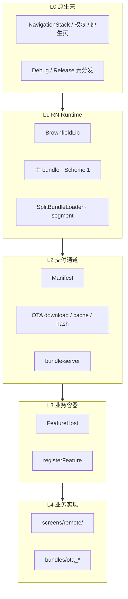
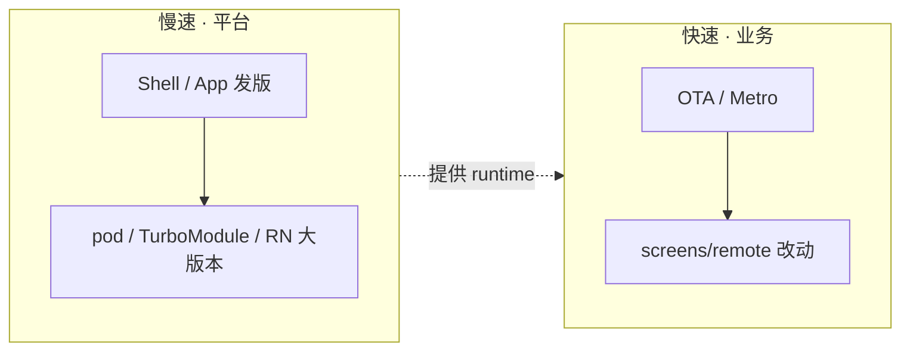

# Brownfield 平台（基站）设计方法

**Date:** 2026-07-09  
**Status:** 生效  
**受众：** 壳维护者、架构决策、新加入的平台/业务开发者  

**相关文档：**

- [团队协作机制](./collaboration.md) — 角色、依赖分层、Capability Request
- [Remote 架构](./dynamic-multi-bundle.md) — Split Bundle + manifest + OTA 实现
- [SOP 操作手册](./sop.md) — 日常流程与发版
- [多 Bundle 方案对比](./multi-bundle.md) — Split / Re.Pack / 多 XCFramework

---

## 1. 「基站」指什么

在本项目中，**基站（平台底座）** 不是电信设备，而是：

> **原生壳 + RN Runtime + OTA/manifest 通道 + 构建/校验工具链 + 协作治理**

业务同事在其上写 JS，**不** 各自 `react-native init`，**不** 私自改 Pod / 壳。

| 层级 | 目录/组件 | 迭代节奏 | 维护者 |
|------|-----------|----------|--------|
| **平台** | `ios_native/`、`rn_app/ios/`、BrownfieldLib、SplitBundleLoader、`bundle-server`、verify 脚本 | 慢（周/月） | 壳维护者 |
| **业务** | `screens/remote/`、`bundles/ota_*/`、feature 逻辑 | 快（日/周，OTA） | RN / Remote 开发者 |

设计基站的核心问题：**什么属于 Runtime 能力，什么属于业务功能？**

---

## 2. 平台 vs 业务：划分原则

| 放进平台（基站） | 放进业务 |
|------------------|----------|
| 导航回壳、Split 加载、OTA 下载与 hash 校验 | Order / Promo 等业务页面 |
| Brownfield 嵌入、TurboModule | 表单、列表、业务 API 调用 |
| manifest、bundle-server、segment 约定 | feature 专属 UI 与流程 |
| 依赖 allowlist、`verify:*` 护栏 | 纯 JS 工具库（L1） |
| Debug/Release 壳分发 | Remote OTA 内容发版 |

**Scheme 1（核心 RN）** 与 **Remote（远程业务 + OTA）** 的产品划分，见 [dynamic-multi-bundle.md](./dynamic-multi-bundle.md)。  
**L1/L2/L3 依赖谁可加**，见 [collaboration.md — 依赖分层](./collaboration.md#依赖分层)。

---

## 3. 分层架构



### 各层职责

| 层 | 职责 | 同事是否直接改 |
|----|------|----------------|
| **L0** | 原生菜单、权限、壳 UI、Simulator `.app` 导出 | ❌ |
| **L1** | 单 Runtime、主 bundle、segment 注册 | ❌ |
| **L2** | 版本、hash、bundleUrl、sharedBundle | ⚠️ 仅 upload / Admin |
| **L3** | 统一 Remote 容器，屏蔽 split/OTA 细节 | ❌（扩展 featureId） |
| **L4** | 业务页面与 OTA 包装 | ✅ |

**设计顺序：** 自下而上定接口，自上而下做隔离。  
L3 对外只暴露 `featureId` + manifest；L4 不感知 segment id、pending/active 路径细节。

---

## 4. 契约驱动（Contract-First）

口头约定不够，平台规则应落成 **可检测的契约**：

| 契约 | 内容 | 本项目实现 |
|------|------|------------|
| **运行时** | shared segment 0 必须先于 feature load | `ensureSharedBundleCached` → `SplitBundleLoader` |
| **构建** | 主 bundle 不含 OTA 专用目录 | `npm run verify:ota-scope` |
| **依赖** | 生产树中 native 包须在 allowlist | `npm run verify:native-deps` + `config/approved-native-deps.json` |
| **发版** | shared + feature 同版本 upload | [SOP-C](./sop.md#5-sop-cremote-ota-发版) |
| **产品** | Remote 全屏、根页回壳 | `popToNative()`、隐藏 SwiftUI nav |

**设计习惯：**

> 每定一条规则，就配一个自动化检查或明确的失败报错；能脚本化的不要只靠文档。

组合校验：`npm run verify` = `verify:ota-scope` + `verify:native-deps`。

---

## 5. 平台设计的五个支柱

### 5.1 单一入口（One Front Door）

| 场景 | 唯一入口 |
|------|----------|
| 日常开发 | 共享 Debug 壳 + `cd rn_app && npm start` |
| Remote 发版 | `build:bundles` → upload → manifest |
| 新增 native 能力 | Capability Request → 壳维护者 |
| 新建 Remote 入口 | [SOP-E](./sop.md#7-sop-e新增-remote-入口端到端)（未来：`scaffold:remote`） |

避免 Metro 自建工程、直改 Podfile、绕过 manifest 等多条并行路径。

### 5.2 双速迭代（Two-Speed Delivery）



| 变更 | 通道 | 业务能否独立 |
|------|------|--------------|
| Remote UI | OTA | ✅ |
| 纯 JS 依赖（L1） | `package.json` PR | ✅ |
| native 依赖（L2/L3） | 新 Shell + App | ❌ |
| Scheme 1 核心页 | 主 bundle / App 发版 | ⚠️ |

设计基站时 **刻意** 划出可 OTA 边界；module id 表、native link 等无法 OTA 的部分归入慢速层。

### 5.3 显式扩展点（Extension Points）

新业务 **只** 扩展以下位置，不碰平台内核：

```
screens/remote/<feature>/     ← Metro 日常 UI
bundles/ota_<id>/             ← OTA 入口 + 薄包装
config/feature-segments.json  ← segment id
bundle-server manifest        ← 入口注册
build-bundles.js bundles[]    ← 构建列表
```

**扩展点越少，基站越稳。** 不要把业务逻辑散落到 `ios_native/`、`src/features/` 核心加载链 unless 平台能力。

### 5.4 可观测与可验证

| 信号 | 用途 | 本项目 |
|------|------|--------|
| bundle 体积 | split 是否正确 | Admin `sizeBytes`、`build-bundles` 告警 |
| version / hash | OTA 是否一致 | manifest、pending/active metadata |
| load 顺序 | unknown module | shared → feature 契约 |
| verify 脚本 | PR 门禁 | `npm run verify` |

**5 分钟定位原则：** 出问题能区分是 **壳 / OTA / Metro / split 图 / 服务端** 哪一层。Fix 记录见 [docs/fixes/](./fixes/)。

### 5.5 治理机制（Governance）

| 手段 | 文档/工具 |
|------|-----------|
| 角色与目录边界 | [collaboration.md](./collaboration.md) |
| native 依赖 allowlist | `config/approved-native-deps.json` |
| Capability Request | [collaboration.md — Issue 模板](./collaboration.md#capability-request-流程) |
| 壳版本分发 | [README — 团队开发](../README.md#团队开发壳打一次同事只-npm-start) |

---

## 6. 从 0 到可协作：演进阶段

```text
Phase 1  能跑
  └─ 壳 + 单 RN 入口 + Metro

Phase 2  能交付
  └─ manifest + OTA + split + hash 校验

Phase 3  能协作          ← 本项目当前主阶段
  └─ 角色分工 + Debug 壳分发 + 目录护栏 + verify 脚本

Phase 4  能规模化
  └─ scaffold:remote + CI verify + Shell 版本 manifest + CODEOWNERS

Phase 5  能优化（按需）
  └─ shared split 调优、HTTP 压缩、差分更新
```

**不要 Phase 1 就做 Phase 5。** 先稳定 Runtime 与协作，再优化体积与传输。压缩/差分规划见 [ota-bundle-compression-roadmap.md](./ota-bundle-compression-roadmap.md)。

### 本项目阶段对照

| Phase | 已落地 |
|-------|--------|
| 1–2 | Brownfield、FeatureHost、bundle-server、split OTA |
| 3 | collaboration.md、`verify:ota-scope`、`verify:native-deps`、shared split、双路径 README |
| 4 | 待实施：CODEOWNERS、CI、`scaffold:remote`、Shell manifest |
| 5 | 规划中：见 [TODO.md](./TODO.md) |

---

## 7. 设计评审清单

每增加一块「基站」能力，壳维护者过一遍：

| # | 问题 |
|---|------|
| 1 | **谁维护？** 是否应限制为壳维护者或明确 owner？ |
| 2 | **同事如何消费？** 是否无需 Xcode / pod / brownfield 打包？ |
| 3 | **失败模式？** 网络失败、hash 失败、壳过旧、shared 未 load 时如何降级/报错？ |
| 4 | **是否可检测？** 能否加入 `npm run verify` 或单测？ |
| 5 | **是否可回滚？** manifest 切换、OTA rollback、Shell 回退？ |
| 6 | **是否与现有契约冲突？** 如 sha256 语义、segment 顺序、双路径规则 |
| 7 | **文档能否一页说清？** onboarding 是否仍 ≤ 4 步？ |

---

## 8. 常见反模式

| 反模式 | 表现 | 对策 |
|--------|------|------|
| **边界模糊** | Metro 与 OTA 源码漂移 | 默认改 `screens/remote/`；OTA 包装极薄 |
| **平台膨胀** | 所有需求都进壳 | L1/L2/L3 分级 + Capability Request |
| **无版本壳** | 同事各自 pod，环境不一致 | Shell 版本化 + 分发 `.app` |
| **隐式 native** | 业务 PR 悄悄 `npm i` 带 pod | `verify:native-deps` |
| **过早抽象** | 一上来 Module Federation / 多 Runtime | 先 split + manifest，不够再升级 |
| **只文档不工具** | 「请勿改 Podfile」无 CI | CODEOWNERS + verify + allowlist |

---

## 9. 设计心法（摘要）

```text
基站 = 稳定的 Runtime
     + 明确的扩展点
     + 可执行的契约
     + 慢速发版的平台团队

业务 = 在扩展点内快速迭代
     + 触及 Runtime 的需求「产品化」为 Capability
```

---

## 10. 下一步（平台路线图）

与 [collaboration.md — 实施优先级](./collaboration.md#实施优先级) 对齐：

| 优先级 | 动作 |
|--------|------|
| **P0** | 维持契约与文档；Shell 版本化宣贯 |
| **P1** | CODEOWNERS、PR 跑 `npm run verify` |
| **P1** | `npm run scaffold:remote` |
| **P2** | Shell manifest、App 内壳版本提示 |
| **P3** | 业务仓与 shell 制品仓拆分（团队扩大后） |

---

## 参考

- [collaboration.md](./collaboration.md)
- [dynamic-multi-bundle.md](./dynamic-multi-bundle.md)
- [multi-bundle.md](./multi-bundle.md)
- [sop.md](./sop.md)
- [case-study-remote-ota-metro-isolation.md](./case-study-remote-ota-metro-isolation.md)
